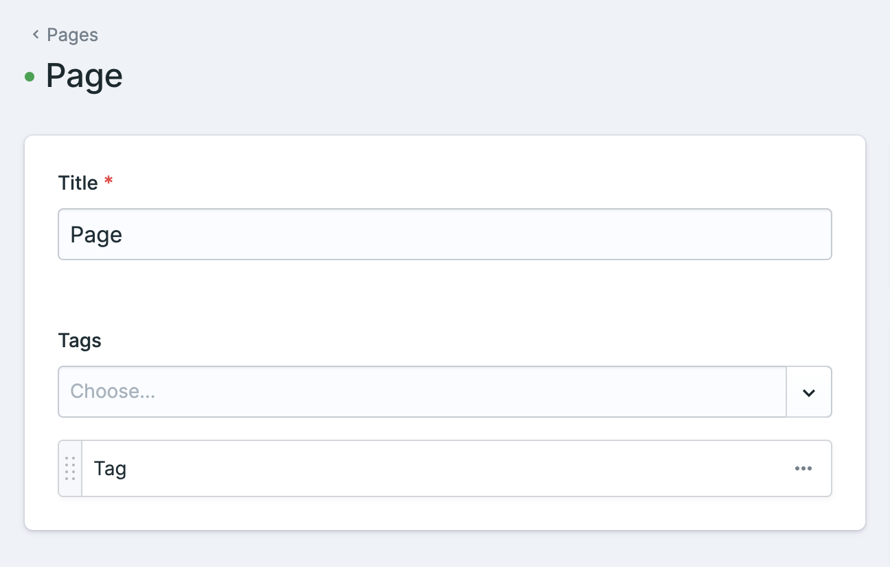
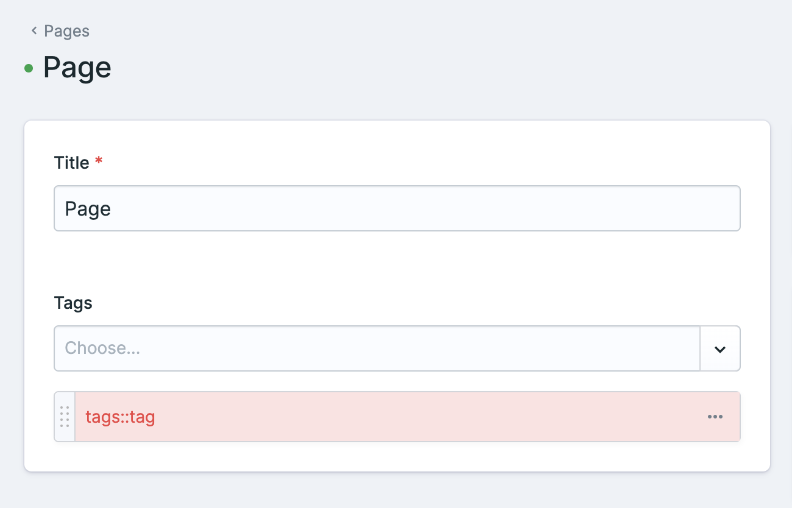

# Repro for Statamic Issue #10938

- Reproduction repro for issue [statamic/cms#10938](statamic/cms/issues/10938)
- Updating a term's slug will not update references to that term in entries

## Superuser

- Email: admin@admin.net
- Password: admin

## Reproducing the error

1. Edit entry `Page` in `pages` collection
2. Ensure the tag is linked and valid: `Tag`
3. Edit term `Tag` in `tags` taxonomy
4. Update the slug field to `tag2` (or some other value) and save
5. Reload the `page` entry
6. The tag should now show up as invalid in red (`tags::tag`)

## Screenshots

### Before updating the term slug

### After updating the term slug

